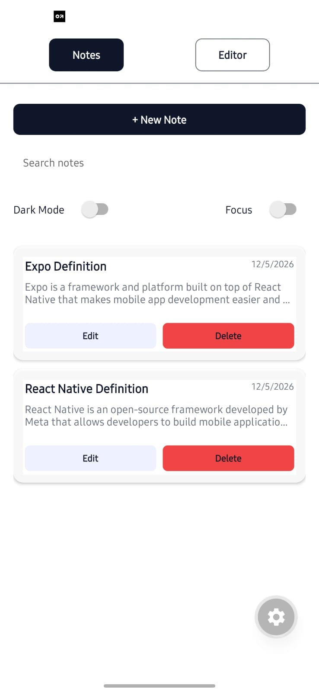
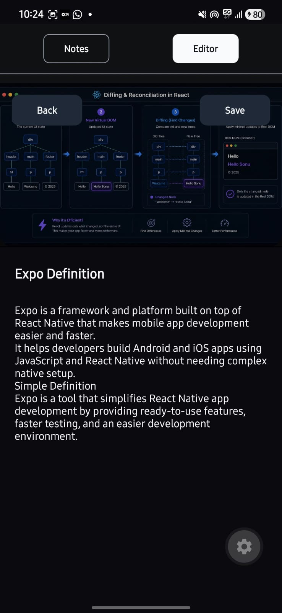

# 📝 Notes App - React Native + Expo

> **Learning Project** by **Sonu Kumar Ray**  
> A responsive Notes Application with dark/light theme, persistent storage, and full CRUD operations.

---

## ✨ Features

- 🎨 Dark/Light Theme Toggle
- 📱 Fully Responsive & Full-Width UI
- 💾 Persistent Storage (SecureStore)
- ✍️ Create, Edit, Delete Notes
- 🖼️ Image Support in Headers
- 🔍 Search & Filter Notes
- ⌨️ Focus Mode
- 📅 Auto Date Tracking

---

## 📸 Screenshots

### Notes List Screen (Light Mode)


### Note Editor (Dark Mode)  


---

## 📁 Project Structure

```
app/
├── _layout.tsx              # Root layout
├── index.tsx                # Screen switcher
├── theme.ts                 # Color palettes
├── hooks/useNotes.ts        # CRUD + storage
└── screens/
    ├── NotesListScreen.tsx  # List view
    └── NoteEditor.tsx       # Editor view
```

---

## 🎨 Theme System

Centralized palette in `app/theme.ts` with `useColorScheme()`:

```typescript
type Palette = {
  background: string;
  surface: string;
  text: string;
  accent: string;
  muted: string;
  // ... more colors
};

export function getPalette(scheme: string) {
  return palettes[scheme] || palettes.light;
}
```

**Light & Dark mode colors** with system detection override.

---

## 🪝 Hooks - `useNotes()`

Complete CRUD operations with SecureStore persistence:

```typescript
type Note = {
  id: string;
  title: string;
  body: string;
  date: string;
  image?: string | null;
};

const { notes, loading, saveNote, deleteNote, getNoteById } = useNotes();
```

**Storage:** SecureStore → localStorage → In-Memory (Fallback)

---

## 📱 Responsive Design

Uses `useWindowDimensions()` for adaptive layout:

```typescript
const { width } = useWindowDimensions();
const isTablet = width > 700;
const padding = isTablet ? 48 : 0;
```

- **Mobile (≤700px):** Full-width layout
- **Tablet (>700px):** Gutter layout (48px padding)

---

## 🛠️ Quick Start

```bash
npm install
npx expo start
# Press 'i' for iOS or 'a' for Android
```

---

## 📚 Components

| Component | Purpose |
|-----------|---------|
| NotesListScreen | Display notes, search, theme toggle |
| NoteEditor | Create/edit notes with image header |
| useNotes | CRUD & data persistence |
| theme.ts | Colors & palette system |

---

## ✅ Implemented Features

- ✅ Full CRUD (Create, Read, Update, Delete)
- ✅ Dark/Light theme toggle
- ✅ Persistent storage (SecureStore)
- ✅ Responsive full-width layout
- ✅ Search & filter notes
- ✅ Image support in headers
- ✅ Focus mode
- ✅ Auto date tracking
- ✅ TypeScript type safety

---

## 👤 Author

**Sonu Kumar Ray** - Learning Phase

---

<div align="center">

**Built with ❤️ using React Native & Expo**

</div>

---

<div align="center">

### ⭐ If you find this project helpful, please consider giving it a star!

**Built with ❤️ using React Native & Expo**

</div>
